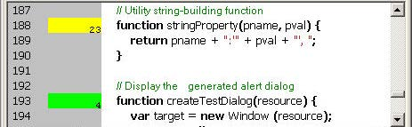
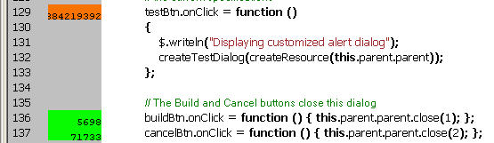

.. _code-profiling-for-optimization:

Code profiling for optimization
===============================
The Profiling tool helps you to optimize program execution. When you turn profiling on, the JavaScript
engine collects information about a program while it is running. It counts how often the program
executed a line or function, or how long it took to execute a line or function. You can choose exactly which
profiling data to display.

Because profiling significantly slows execution time, the Profile menu offers these profiling options.

===================  ======================================================================================
Off                  Profiling turned off. This is the default.
Functions            The profiler counts each function call. At the end of execution, displays the total to
                     the left of the line number where the function header is defined.
Lines                The profiler counts each time each line is executed. At the end of execution,
                     displays the total to the left of the line number.
                     Consumes more execution time, but delivers more detailed information.
Add Timing Info      Instead of counting the functions or lines, records the time taken to execute each
                     function or line. At the end of execution, displays the total number of
                     microseconds spent in the function or line, to the left of the line number.
                     This is the most time-consuming form of profiling.
No Profiler Data     When selected, do not display profiler data.
Show Hit Count       When selected, display hit counts.
Show Timing          When selected, display timing data.
Erase Profiler Data  Clear all profiling data.
Save Data As         Save profiling data as comma-separated values in a CSV file that can be loaded
                     into a spreadsheet program such as Excel.
===================  ======================================================================================

When execution halts (at termination, at a breakpoint, or due to a runtime error), the Toolkit displays this
information in the Document Window, line by line. The profiling data is color coded:

- Green indicates the lowest number of hits, or the fastest execution time.
- Orange or yellow indicates a trouble spot, such as a line that has been executed many times, or which
  line took the most time to execute.

This example shows number-of-hits information:

This example displays timing information for the program, in microseconds. The timing might not be
accurate down to the microsecond; it depends on the resolution and accuracy of the hardware timers built
into your computer.

