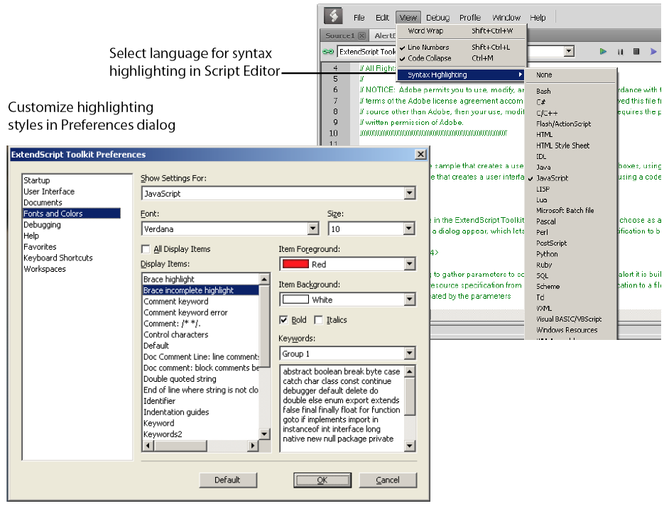

# The Script Editor

The Script Editor is a full-featured source code editor for JavaScript. You can open any number of Script Editor document windows; each displays one Unicode source code document.

The Script Editor offers many useful and powerful text editing and navigation features. Some are intended specifically for use with JavaScript, while others are useful for all kinds of text editing. Features include:

- Navigation aids and options applicable to any kind of text, and specific code navigation for JavaScript; see [Navigation aids](#navigation-aids).
- General editing and coding support such as undo-redo, and specific JavaScript coding support such as syntax checking; see [Coding aids](#coding-aids).
- A full-featured text search tool that can search in multiple files; see [Searching in text](#searching-in-text).
- Syntax marking (color and font styles for specific syntactic structures) for JavaScript and for many other computer languages. The marking styles are configurable; see [Syntax marking](#syntax-marking).

---

## Navigation aids

You can configure the Script Editor to display text with various features that help you track the structure of your code, or that help you move around in the file. It also offers mouse and keyboard shortcuts for specific types of cursor movement and text selection.

### View options

The Script Editor offers a number of viewing options that aid in code navigation, including the following:

- Automatic line numbering. View > Line Numbers toggles numbering on and off.
- A collapsible tree view of code, where you can open or close logical units of the structure, such as comments or function definitions. View > Code Collapse toggles the tree view on and off.
- A line-wrapping mode, where there is no horizontal scroll bar, and lines are wrapped at word breaks. View > Word Wrap toggles line-wrapping on and off.
- Syntax marking, which uses color and font styles to highlight specific syntactic structures. View >
- Syntax Highlighting allows you to turn syntax marking off, or set it to mark a particular language, JavaScript or many other computer languages. The marking styles are configurable; see [Syntax marking](#syntax-marking).

You can set the default values for any of these states using the Documents page of the Preferences dialog (Edit > Preferences).

### Function finders

The Functions panel, and the flyout menu at the top right of the document window, both offer lists of functions defined in the current document. When you select a function in either list, the document jumps directly to that function definition in the code.


### Bookmarks

The Edit > Bookmarks menu allows you to set and clear navigation points in your text. The F2 function key is the default shortcut key for the bookmark commands:

- Toggle the bookmark for the current line using CTRL-F2.
- Move the cursor to the next bookmark with F2, or to the previous one with SHIFT-F2. The bookmarks wrap, so that the first follows the last.
- Use SHIFT-CTRL-F2 to clear all bookmarks in the current text.

When you navigate to a bookmark in a collapsed section of code, that section automatically opens.

Bookmarks are marked with a blue, right-pointing arrow at the left of the line (to the right of the line number if it is shown). This is the same place where a breakpoint is marked with a dot (see [Setting breakpoints](debugging-in-the-toolkit.md#setting-breakpoints)). If you have both a breakpoint and a bookmark set in the same line, the blue arrow is superimposed on the breakpoint dot.


### Mouse navigation and selection

You can use the mouse or special keyboard shortcuts to move the insertion point or to select text in the document window. Click the left mouse button in the document window to move the position caret.

To select text with the mouse, click in unselected text, then drag over the text to be selected. If you drag above or below the currently displayed text, the text scrolls, continuing to select while scrolling. You can also double-click to select a word, or triple-click to select a line.

To initiate a drag-and-drop of selected text, click in the block of selected text, then drag to the destination. You can drag text from one document window to another. You can also drag text out of the Toolkit into another application that accepts dragged text, and drag text from another application into a Toolkit document window.

You can drop files from the Explorer or the Finder onto the Toolkit to open them in a document window.

### Keyboard navigation and selection

The Keyboard Shortcuts page in the Preferences dialog **(Edit > Preferences)** allows you to set or modify keyboard shortcuts for all menu commands.

In addition to the keyboard shortcuts specified for menu commands, and the usual keyboard input, the document window accepts these special movement keys. You can also select text by using a movement key while pressing `SHIFT`.

|       Shortcut       |                           Behaviour                            |
| -------------------- | -------------------------------------------------------------- |
| `ENTER`              | Insert a Line Feed character                                   |
| `Backspace`          | Delete character to the left                                   |
| `DELETE`             | Delete character to the right                                  |
| `Left arrow`         | Move insertion point left one character                        |
| `Right arrow`        | Move insertion point right one character                       |
| `Up arrow`           | Move insertion point up one line; stay in column if possible   |
| `Down arrow`         | Move insertion point down one line; stay in column if possible |
| `Page up`            | Move insertion point one page up                               |
| `Page down`          | Move insertion point one page down                             |
| `CTRL + Up arrow`    | Scroll up one line without moving the insertion point          |
| `CTRL + Down arrow`  | Scroll down one line without moving the insertion point        |
| `CTRL + Page up`     | Scroll one page up without moving the insertion point          |
| `CTRL + page down`   | Scroll one page down without moving the insertion point        |
| `CTRL + Left arrow`  | Move insertion point one word to the left                      |
| `CTRL + right arrow` | Move insertion point one word to the right                     |
| `HOME`               | Move insertion point to start of line                          |
| `END`                | Move insertion point to end of line                            |
| `CTRL + HOME`        | Move insertion point to start of text                          |

The Script Editor supports extended keyboard input via IME (Windows) or TMS (Mac OS). This is especially important for Far Eastern characters.

---

## Coding aids

The Script Editor offers a number of visual and editing features that help you navigate in and maintain the syntactic structure of your JavaScript code, including the following.

### Code completion

When you position the cursor in a document and begin typing, the Toolkit offers completion choices from among keywords, global functions, functions that are defined in the current document, and functions defined in the object-model dictionary that is currently selected from the flyout menu.


You can use the flyout menu at the upper right corner of the document window to choose an object-model dictionary to use for completion. Available dictionaries depend on which applications are loaded. See [Inspecting object models](inspecting-object-models.md).


### Brace matching

The Edit menu offers two kinds of brace-matching selection, that operate when the cursor is placed immediate after an opening brace character, or immediately before a closing brace:

- **Edit > Select to Brace**: Moves the cursor to the matching bracing, but does not select any text. The default keyboard shortcut is `CTRL 0` (zero).
- **Edit > Select Including Brace**: Selects all text between the braces. The default keyboard shortcut is `SHIFT CTRL 0` (zero).

Brace characters include parentheses, curly braces, and square brackets.

### Block indentation

When Word Wrap is off, you can automatically indent or outdent entire blocks of text. To indent a block of text, select some or all of the text on the line or lines, and press TAB. (Be careful; if Word Wrap is on, this deletes the selected text.) To outdent, press `SHIFT TAB`.

### Comment and uncomment commands

Use **Edit > Comment or Uncomment Selection** to temporarily remove parts of a JavaScript program from the path of execution. This command is a toggle. When you first issue the command, it places the special comment sequence //~ at the front of any line that is wholly or partially selected. When you next issue the command with such a line selected, it removes that comment marker.

The command affects only the comment markers it places in the text; it ignores any comment markers that were already in the selected lines. This allows you to temporarily remove and replace blocks of text that include both code and comments.

### Version comments

A special comment format is reserved for a code versioning statement, which is used internally by Adobe scripts, but is available to all scripters. Use Edit > Insert Version Tag to insert a comment containing the file name and current date-time, in this format:

```javascript
/**
 * @@@BUILDINFO@@@ SnpCreateDialog.jsx !Version! Tue Dec 05 2006 08:03:38 GMT-0800
 */
```

You are responsible for manually updating the !Version! portion with your own version information.

### Undo and redo

Choose **Undo** or **Redo** from the **Edit** menu or from the document window's right-click context menu to revoke and reinstate multiple editing changes sequentially. The change history is kept from when a file is created or loaded, and maintained through file-save operations.

### Syntax checking

Before running the new script or saving the text as a script file, use **Edit > Check Syntax** to check whether the text contains JavaScript syntax errors. The default keyboard shortcut is `F7`.

- If the script is syntactically correct, the status line shows "No syntax errors."
- If the Toolkit finds a syntax error, such as a missing quote, it highlights the affected text, plays a sound, and shows the error message in the status line so you can fix the error.

### Multiline statements

The Script Editor supports triple-quote syntax to allow strings to span several source code lines. When entering a very long string, you can:

- Enter it all on one line:
    ```javascript
    var myString = "This very long string might wrap onto a second line visually, but you typed no CR character when entering it."
    ```
- Enter on multiple lines, using a backslash () continuation character at the end of each line:
    ```javascript
    var myString = "This string spans \
    two lines."
    ```
- Use triple quotes around the entire string on multiple lines:
    ```javascript
    var myString = """This "quoted" word is inside the
    multiline string enclosed by triple quotes."""
    ```

The triple-quote option allows the string to contain embedded quotes.

---

## Searching in text

The Toolkit offers a search utility through the Edit > Find and Replace command. This command brings up the Find and Replace panel. If the panel is not docked, you can hide it by pressing ESC.

The Find and Replace panel allows you to search through multiple documents for text that matches a specific search string or regular expression. You can choose to search in:

- The current document, or the current selection in the current document
- All open documents
- All scripts made public by the current target application
- Folders that you have defined as favorite locations; see [The Scripts panel and favorite script locations](selecting-scripts.md#the-scripts-panel-and-favorite-script-locations).


The results of a search are listed in the Find Results tab; by default, this is stacked with the Find and Replace panel, but you can drag it to another stack, or display it as an independent floating panel.


Double-click a result line in the Find Results panel to jump directly to the document and line where the text was found.

### Using regular-expression syntax

The Toolkit supports a limited set of Regular Expression syntax for the Find and Replace dialog:

| RegEx Token |                                                                             Behaviour                                                                             |
| ----------- | ----------------------------------------------------------------------------------------------------------------------------------------------------------------- |
| `.`         | Matches any character                                                                                                                                             |
| `(`         | Marks the start of a region for capturing a match.                                                                                                                |
| `)`         | Marks the end of a capturing region.                                                                                                                              |
| `\<`        | Matches the start of a word using the editor's current definition of words.                                                                                       |
| `\>`        | Matches the end of a word using the editor's current definition of words.                                                                                         |
| `\x`        | Escapes a character x that would otherwise have a special meaning. For example, [ is<br/>interpreted as a left bracket, rather than the start of a character set. |
| `[...]`     | A set of characters; for example, [abc] means any of the characters a, b or c.<br/>You can also use ranges, for example [a-z] for any lower case character.       |
| `[^...]`    | The complement of the characters in a set. For example, [^A-Za-z] means any character<br/>except an alphabetic character.                                         |
| `^`         | Matches the start of a line (unless used inside a set).                                                                                                           |
| `$`         | Matches the end of a line.                                                                                                                                        |
| `*`         | Matches 0 or more times. For example, Sa\*m matches Sm, Sam, Saam, Saaam etc.                                                                                     |

In a replace operation, you can use the captured regions of a match in the replacement expression by using the placeholders `\1` through `\9`, where `\1` refers to the first captured region, `\2` to the second, and so on.

For example, if the search string is `Fred\([1-9]\)XXX` and the replace string is `Sam\1YYY`, when applied to `Fred2XXX` the search generates `Sam2YYY`.

## Syntax marking

The Script Editor offers language-based syntax highlighting to aid in editing code. Although the debugging features (including syntax checking) are only available for JavaScript, you can choose to edit other kinds of code, and the syntax is highlighted according to the language. The style of syntax marking is automatically set to match the file extension, or you can choose the language from the View > Syntax **Highlighting** menu.

The style of highlighting is configurable, using the Fonts and Colors page of the Preferences dialog.


