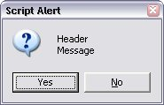
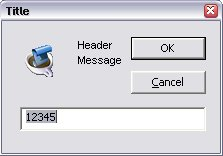

# User notification dialogs

ExtendScript provides a set of globally available functions that allow you to display short messages to the user in platform-standard dialog boxes. There are three types of message dialogs:

- **Alert** - Displays a dialog containing a short message and an **OK** button.
- **Confirm** - Displays a dialog containing a short message and two buttons, **Yes** and **No**, allowing the user to accept or reject an action.
- **Prompt** - Displays a dialog containing a short message, a text entry field, and **OK** and **Cancel** buttons, allowing the user to supply a value to the script.

These dialogs are customizable to a small degree. The appearance is platform specific.

---

## Global Methods

### alert()

`alert(message[, title="Script Alert", errorIcon=false]);`

#### Description

Displays a platform-standard dialog containing a short message and an **OK** button.

#### Parameters

| Parameter |  Type   |                                                                                        Description                                                                                         |
| --------- | ------- | ------------------------------------------------------------------------------------------------------------------------------------------------------------------------------------------ |
| message   | String  | The string for the displayed message.                                                                                                                                                      |
| title     | String  | Optional. A string to appear as the title of the dialog, if the platform supports a title. Mac OS does not support titles for alert dialogs. The default title string is `"Script Alert"`. |
| errorIcon | Boolean | Optional. When `true`, the platform-standard alert icon is replaced by the platform-standard error icon in the dialog. Default is `false`.                                                 |

#### Returns

Returns nothing

#### Examples

This figure shows simple alert dialogs in Windows and in Mac OS.

This figure shows alert dialogs with error icons.

---

### confirm()

`confirm(message[,noAsDflt=false, title="Script Alert"]);`

#### Description

Displays a platform-standard dialog containing a short message and two buttons labeled Yes and No.

#### Parameters

| Parameter |  Type   |                                                                                            Description                                                                                            |
| --------- | ------- | ------------------------------------------------------------------------------------------------------------------------------------------------------------------------------------------------- |
| message   | String  | The string for the displayed message.                                                                                                                                                             |
| noAsDflt  | Boolean | Optional. When `true`, the **No** button is the default choice, selected when the user types `ENTER`. Default is `false`, meaning that **Yes** is the default choice.                             |
| title     | String  | Optional. A string to appear as the title of the dialog, if the platform supports a title. Mac OS does not support titles for confirmation dialogs. The default title string is `"Script Alert"`. |

#### Returns

Returns `true` if the user clicked **Yes**, `false` if the user clicked **No**.

#### Examples

This figure shows simple confirmation dialogs on Windows and Mac OS.

This figure shows confirmation dialogs with No as the default button.

---

### prompt()

`prompt(message, preset[, title="Script Alert"]);`

#### Description

Displays a platform-standard dialog containing a short message, a text edit field, and two buttons labeled **OK** and **Cancel**.

#### Parameters

| Parameter |  Type  |                                                                                            Description                                                                                            |
| --------- | ------ | ------------------------------------------------------------------------------------------------------------------------------------------------------------------------------------------------- |
| message   | String | The string for the displayed message.                                                                                                                                                             |
| preset    | String | The initial value to be displayed in the text edit field.                                                                                                                                         |
| title     | String | Optional. A string to appear as the title of the dialog, if the platform supports a title. Mac OS does not support titles for confirmation dialogs. The default title string is `"Script Alert"`. |

#### Returns

Returns the value of the text edit field if the user clicked **OK**, `null` if the user clicked **Cancel**.

#### Examples

This figure shows simple prompt dialogs on Windows and Mac OS.

This figure shows confirmation dialogs with a title value specified.

