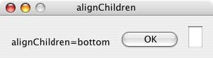
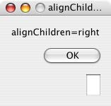
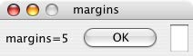
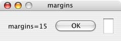
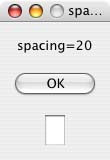
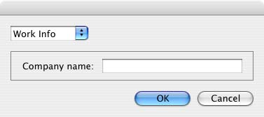
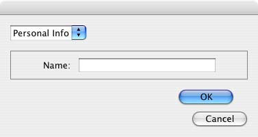

# Automatic layout

When a script creates a window and its associated user-interface elements, it can explicitly control the size and location of each element and of the container elements, or it can take advantage of the automatic layout capability provided by ScriptUI. The automatic layout mechanism uses certain available information about user-interface elements, along with a set of layout rules, to establish a visually pleasing layout of the controls in a dialog, automatically determining the proper sizes for elements and containers.

Automatic layout is easier to program than explicit layout. It makes a script easier to modify and maintain, and easier to localize for different languages. It also makes the script automatically adapt to the default font and font size used by the host application for ScriptUI windows.

The script programmer has considerable control over the automatic layout process. Each container has an associated layout manager object, specified in the layout property. The layout manager controls the sizes and positions of the contained elements, and also sizes the container itself. There is a default layout manager object, or you can create a new one:

```javascript
myWin.layout = new AutoLayoutManager( myWin );
```

---

## Default layout behavior

By default, the autoLayoutManager object implements the default layout behavior. A script can modify the properties of the default layout manager object, or create a new, custom layout manager if it needs more specialized layout behavior. See [Custom layout-manager example](#custom-layout-manager-example).

Child elements of a container can be organized in a single row or column, or in a stack, where the elements overlap one other in the same region of the container, and only the top element is fully visible. This is controlled by the container's orientation property, which can have the value row, column, or stack.

You can nest Panel and Group containers to create more complex organizations. For example, to display two columns of controls, you can create a panel with a row orientation that in turn contains two groups, each with a column orientation.

Containers have properties to control inter-element spacing and margins within their edges. The layout manager provides defaults if these are not set.

The alignment of child elements within a container is controlled by the alignChildren property of the container, and the alignment property of the individual controls. The alignChildren property determines an overall strategy for the container, which can be overridden by a particular child element's alignment value.

A layout manager can determine the best size for a child element through the element's preferredSize property. The value defaults to dimensions determined by ScriptUI based on characteristics of the control type and variable characteristics such as a displayed text string, and the font and size used to display text. A value of -1 for either the width or height in the preferredSize value causes the layout manager to calculate that dimension, while using the specified value for the other.

For details of how you can set these property values to affect the automatic layout, see [Automatic layout properties](#automatic-layout-properties).

!!! note
    The default font and font size are chosen differently on different platforms, and by different applications on the same platform, so ScriptUI windows that are created the same way can appear different in different contexts.

---

## Automatic layout properties

Your script establishes rules for the layout manager by setting the values of certain properties, both in the container object and in the child elements. The following examples show the effects of various combinations of values for these properties. The examples are based on a simple window containing a StaticText, Button and EditText element, created (using Resource specifications) as follows:

```javascript
var w = new Window( "window { \
    orientation: 'row', \
    st: StaticText { }, \
    pb: Button { text: 'OK' }, \

    et: EditText { characters:4, justify:'right' } \
}");

w.show();
```

Each example shows the effects of setting particular layout properties in various ways. In each window, w. text is set so that the window title shows which property is being varied, and w.st.text is set to display the particular property value being demonstrated.

---

### Container orientation

The `orientation` property of a container specifies the organization of child elements within it. It can have these values:

|  Value   |                                                                                                                                                                                  Behavior                                                                                                                                                                                  |
| -------- | -------------------------------------------------------------------------------------------------------------------------------------------------------------------------------------------------------------------------------------------------------------------------------------------------------------------------------------------------------------------------- |
| `row`    | Child elements are arranged next to each other, in a single row from left to right across the container. The height of the container is based on the height of the tallest child element in the row, and the width of the container is based on the combined widths of all the child elements.                                                                             |
| `column` | Child elements are arranged above and below each other, in a single column from top to bottom across the container. The height of the container is based on the combined heights of all the child elements, and the width of the container is based on the widest child element in the column.                                                                             |
| `stack`  | Child elements are arranged overlapping one another, as in a stack of papers. The elements overlie one another in the same region of the container. Only the top element is fully visible. The height of the container is based on the height of the tallest child element in the stack, and the width of the container is based on the widest child element in the stack. |

The following figure shows the results of laying out the sample window with each of these orientations:


---

### Aligning children

The alignment of child elements within a container is controlled by two properties: alignChildren in the parent container, and alignment in each child. The alignChildren value in the parent container controls the alignment of all children within that container, unless it is overridden by the alignment value set on an individual child element.

These properties use the same values, which specify alignment along one axis, depending on the orientation of the container. You can specify an array of two of these strings, to specify alignment along both axes. The first string specifies the horizontal value, the second specifies the vertical value. The property values are not case-sensitive; for example, the strings FILL, Fill, and fill are all valid.

You can also set the value using the corresponding constants from the Alignment property of the ScriptUI class; for example:

```javascript
myGroup.alignment = [ ScriptUI.Alignment.LEFT, ScriptUI.Alignment.TOP]
```

If you set the `alignment` value using a constant and then query the property, it returns an index number corresponding to the constant, rather than a string value.

Elements in a row can be aligned along the vertical axis, in these ways:

|  Value   |                                                 Behavior                                                 |
| -------- | -------------------------------------------------------------------------------------------------------- |
| `top`    | The element's top edge is located at the top margin of its container.                                    |
| `bottom` | The element's bottom edge is located at the bottom margin of its container.                              |
| `center` | The element is centered within the top and bottom margins of its container.                              |
| `fill`   | The element's height is adjusted to fill the height of the container between the top and bottom margins. |

Elements in a column can be aligned along the horizontal axis, in these ways:

|  Value   |                                                Behavior                                                |
| -------- | ------------------------------------------------------------------------------------------------------ |
| `left`   | The element's left edge is located at the left margin of its container.                                |
| `right`  | The element's right edge is located at the right margin of its container.                              |
| `center` | The element is centered within the right and left margins of its container.                            |
| `fill`   | The element's width is adjusted to fill the width of the container between the right and left margins. |

Elements in a stack can be aligned along either the vertical or the horizontal axis, in these ways:

|  Value   |                                                                                                       Behavior                                                                                                       |
| -------- | -------------------------------------------------------------------------------------------------------------------------------------------------------------------------------------------------------------------- |
| `top`    | The element's top edge is located at the top margin of its container, and the element is centered within the right and left margins of its container.                                                                |
| `bottom` | The element's bottom edge is located at the bottom margin of its container, and the element is centered within the right and left margins of its container.                                                          |
| `left`   | The element's left edge is located at the left margin of its container, and the element is centered within the top and bottom margins of its container.                                                              |
| `right`  | The element's right edge is located at the right margin of its container, and the element is centered within the top and bottom margins of its container.-                                                           |
| `center` | The element is centered within the top, bottom, right and left margins of its container.                                                                                                                             |
| `fill`   | The element's height is adjusted to fill the height of the container between the top and bottom margins., and the element's width is adjusted to fill the width of the container between the right and left margins. |

The following figure shows the results of creating the sample window with row orientation and the `bottom` and `top` alignment settings in the parent's `alignChildren` property:




The following figure shows the results of creating the sample window with column orientation and the right, left, and fill alignment settings in the parent's alignChildren property. Notice how in the fill case, each element is made as wide as the widest element in the container:





You can override the container's child alignment, as specified by `alignChildren`, by setting the alignment property of a particular child element. The following diagram shows the result of setting alignment to right for the EditText element, when the parent's `alignChildren` value is left:


---

### Alignment in two dimensions

You can set the alignment property with a two-string array instead of a single string, where the first string is the horizontal alignment and the second is the vertical alignment. This allows you to control the horizontal placement of children in a container with row orientation, and the vertical placement of children in a container with column orientation.

The following figures show the results of the sample script [SnpAlignElements.jsx](https://github.com/Adobe-CEP/CEP-Resources/blob/master/ExtendScript-Toolkit/Samples/javascript/SnpAlignElements.jsx), that demonstrates how to specify alignment in two dimensions.

- In the first, each control is centered vertically within its row, and placed at a specific horizontal position, using an alignment value such as `["left", "center"]` for each element:
    
- The vertical alignment example creates four columns, and places the controls within each column along the vertical axis. It uses alignment values such as `["fill", "top"]` to distribute controls within the column, while still controlling the relative vertical positions:
    

---

### Setting margins

The margins property of a container specifies the number of pixels between the edges of a container and the outermost edges of the child elements. You can set this property to a simple number to specify equal margins, or using a Margins object, which allows you to specify different margins for each edge of the container.

The following figure shows the results of creating the sample window with row orientation and margins of 5 and 15 pixels:




This figure shows the results of creating the sample window with column orientation, a top margin of 0 pixels, a bottom margin of 20 pixels, and left and right margins of 15 pixels:


---

### Spacing between children

The spacing property of a container specifies the number of pixels separating one child element from its adjacent sibling element.

This figure shows the results of creating the sample window with row orientation, and spacing of 15 and 5 pixels, respectively:


This figure shows the results of creating the sample window with column orientation, and spacing of 20 pixels:



---

### Determining a preferred size

Each element has a preferredSize property, which is initially defined with reasonable default dimensions for the element. The default value is calculated by ScriptUI, and is based on constant characteristics of each type of element, and variable characteristics such as the text string to be displayed in a button or text element.

If an element's size property is not defined, the layout manager uses the value of preferredSize to determine the dimensions of each element during the layout process. Generally, you should avoid setting the preferredSize property explicitly, and let ScriptUI determine the best value based on the state of an element at layout time. This allows you to set the text properties of your user-interface elements using localizable strings (see [Localization in ScriptUI objects](localization-in-scriptui-objects.md)). The width and height of each element are calculated at layout time based on the chosen language-specific text string, rather than relying on the script to specify a fixed size for each element.

However, a script can explicitly set the preferredSize property to give hints to the layout manager about the intended sizes of elements for which a reasonable default size is not easily determined, such as an IconButton element that has no initial image to measure.

You can set just one of the dimensions using the preferredSize; a value of -1 for either width or height causes the layout manager to calculate that dimension, while using the supplied value for the other.

You can also set a maximum and/or minimum size value for a control, that limit how it can be resized. There is a default maximum size that prevents automatic layout from creating elements larger than the screen.

You can explicitly resize the controls in a window to fit the current text contents, or after the window is resized by the user, using the [resize()](layoutmanager-object.md#resize) method of the layout object.

---

### Creating more complex arrangements

You can easily create more complex arrangements by nesting Group containers within Panel containers and other `Group` containers.

Many dialogs consist of rows of information to be filled in, where each row has columns of related types of controls. For instance, an edit field is typically in a row next to a static text label that identifies it, and a series of such rows are arranged in a column. This example (created using [Resource specifications](resource-specifications.md)) shows a simple dialog in which a user can enter information into two EditText fields, each arranged in a row with its StaticText label. To create the layout, a `Panel` with a column orientation contains two `Group` elements with row orientation. These groups contain the control rows. A third `Group`, outside the panel, contains the row of buttons.

```javascript
var res = "dialog { \
    info: Panel { orientation: 'column', \
        text: 'Personal Info', \
        name: Group { orientation: 'row', \
            s: StaticText { text:'Name:' }, \
            e: EditText { characters: 30 } \
        }, \
        addr: Group { orientation: 'row', \
            s: StaticText { text:'Street / City:' }, \
            e: EditText { characters: 30 } \
        } \
    }, \
    buttons: Group { orientation: 'row', \
        okBtn: Button { text:'OK', properties:{name:'ok'} }, \
        cancelBtn: Button { text:'Cancel', properties:{name:'cancel'} } \
    } \
}";
win = new Window( res );
win.center();
win.show();
```


In this simplest example, the columns are not vertically aligned. When you are using fixed-width controls in your rows, a simple way to get an attractive alignment of the StaticText labels for your EditText fields is to align the child rows in the Panel to the right of the panel. In the example, add the following to the Panel specification:

```javascript
info: Panel { orientation: 'column', alignChildren:'right', \
```

This creates the following result:


Suppose now that you need two panels, and want each panel to have the same width in the dialog. You can specify this at the level of the dialog window object, the parent of both panels. Specify `alignChildren="fill"`, which makes each child of the dialog match its width to the widest child.

```javascript
var res = "dialog { alignChildren: 'fill', \
    info: Panel { orientation: 'column', alignChildren:'right', \
        text: 'Personal Info', \
        name: Group { orientation: 'row', \
            s: StaticText { text:'Name:' }, \
            e: EditText { characters: 30 } \
        } \
    }, \
    workInfo: Panel { orientation: 'column', \
        text: 'Work Info', \
        name: Group { orientation: 'row', \
            s: StaticText { text:'Company name:' }, \
            e: EditText { characters: 30 } \
        } \
    }, \
    buttons: Group { orientation: 'row', alignment: 'right', \
        okBtn: Button { text:'OK', properties:{name:'ok'} }, \
        cancelBtn: Button { text:'Cancel', properties:{name:'cancel'} } \
    } \
}";
win = new Window( res );
win.center();
win.show();
```


To make the buttons to appear at the right of the dialog, the `buttons` group overrides the `fill` alignment of its parent (the dialog), and specifies `alignment="right"`.

---

### Creating dynamic content

Many dialogs need to present different sets of information based on the user selecting some option within the dialog. You can use the stack orientation to present different views in the same region of a dialog.

A `stack` orientation of a container places child elements so they are centered in a space which is wide enough to hold the widest child element, and tall enough to contain the tallest child element. If you arrange groups or panels in such a stack, you can show and hide them in different combinations to display a different set of controls in the same space, depending on other choices in the dialog.

For example, this dialog changes dynamically according to the user's choice in the `DropDownList`.




The following script creates this dialog. It compresses the "Personal Info" and "Work Info" panels from the previous example into a single `Panel` that has two `Groups` arranged in a stack. A `DropDownList` allows the user to choose which set of information to view. When the user makes a choice in the list, its `onChange` function shows one group, and hides the other.

```javascript
var res = "dialog { \
    whichInfo: DropDownList { alignment:'left' }, \
    allGroups: Panel { orientation:'stack', \
        info: Group { orientation: 'column', \
            name: Group { orientation: 'row', \
                s: StaticText { text:'Name:' }, \
                e: EditText { characters: 30 } \
            } \
        }, \
        workInfo: Group { orientation: 'column', \
            name: Group { orientation: 'row', \
                s: StaticText { text:'Company name:' }, \
                e: EditText { characters: 30 } \
            } \
        }, \
    }, \
    buttons: Group { orientation: 'row', alignment: 'right', \
        okBtn: Button { text:'OK', properties:{name:'ok'} }, \
        cancelBtn: Button { text:'Cancel', properties:{name:'cancel'} } \
    } \
}";

win = new Window( res );
win.whichInfo.onChange = function () {
    if ( this.selection !== null ) {
        for ( var g = 0; g < this.items.length; g++ ) {
            this.items[ g ].group.visible = false; //hide all other groups
        }
        this.selection.group.visible = true;//show this group
    }
};

var item = win.whichInfo.add( "item", "Personal Info" );
item.group = win.allGroups.info;
item = win.whichInfo.add( "item", "Work Info" );
item.group = win.allGroups.workInfo;

// TODO: Which of these are correct or best
win.whichInfo.selection = win.whichInfo.items[ 0 ];
win.whichInfo.selection = 0;

win.center();
win.show();
```

---

## Custom layout-manager example

This script creates a dialog almost identical to the one in the previous example, except that it defines a layout-manager subclass, and assigns an instance of this class as the layout property for the last Group in the dialog. (The example also demonstrates the technique for defining a reusable class in JavaScript.)

This script-defined layout manager positions elements in its container in a stair-step fashion, so that the buttons are staggered rather than in a straight line.



```javascript
// Define a custom layout manager that arranges the children
// of "container" in a stair-step fashion.
function StairStepButtonLayout( container ) {
    this.initSelf( container );
}

// Define its "method" functions
function SSBL_initSelf( container ) {
    this.container = container;
}

function SSBL_layout() {
    var top = 0,
    left = 0;
    var width;
    var vspacing = 10,
    hspacing = 20;
    for ( i = 0; i < this.container.children.length; i++ ) {
        var child = this.container.children[ i ];

        // If child is a container, call its layout method
        if ( typeof child.layout !== "undefined" ) {
            child.layout.layout();
        }

        child.size = child.preferredSize;
        child.location = [ left, top ];
        width = left + child.size.width;
        top += child.size.height + vspacing;
        left += hspacing;
    }
    this.container.preferredSize = [ width, top - vspacing ];
}

// Attach methods to Object's prototype
StairStepButtonLayout.prototype.initSelf = SSBL_initSelf;
StairStepButtonLayout.prototype.layout = SSBL_layout;

// Define a string containing the resource specification for the controls
var res = "dialog { \
    whichInfo: DropDownList { alignment:'left' }, \
    allGroups: Panel { orientation:'stack', \
        info: Group { orientation: 'column', \
            name: Group { orientation: 'row', \
                s: StaticText { text:'Name:' }, \
                e: EditText { characters: 30 } \
            } \
        }, \
        workInfo: Group { orientation: 'column', \
            name: Group { orientation: 'row', \
                s: StaticText { text:'Company name:' }, \
                e: EditText { characters: 30 } \
            } \
        }, \
    }, \
    buttons: Group { orientation: 'row', alignment: 'right', \
        okBtn: Button { text:'OK', properties:{name:'ok'} }, \
        cancelBtn: Button { text:'Cancel', properties:{name:'cancel'} } \
    } \
}";

// Create window using resource spec
win = new Window( res );

// Create list items, select first one
win.whichInfo.onChange = function() {
    if ( this.selection !== null ) {
        for ( var g = 0; g < this.items.length; g++ ) {
            this.items[ g ].group.visible = false;
        }
        this.selection.group.visible = true;
    }
};
var item = win.whichInfo.add( "item", "Personal Info" );
item.group = win.allGroups.info;
item = win.whichInfo.add( "item", "Work Info" );
item.group = win.allGroups.workInfo;

win.whichInfo.selection = 0;

// Override the default layout manager for the 'buttons' group
// with custom layout manager
win.buttons.layout = new StairStepButtonLayout( win.buttons );
win.center();
win.show();
```

---

## The AutoLayoutManager algorithm

When a script creates a Window object and its elements and shows it the first time, the visible user-interface-platform window and controls are created. At this point, if no explicit placement of controls was specified by the script, all the controls are located at [0, 0] within their containers, and have default dimensions. Before the window is made visible, the layout manager's layout method is called to assign locations and sizes for all the elements and their containers.

The default AutoLayoutManager's layout method performs these steps when invoked during the initial call to a Window object's show method:

1. Read the bounds property for the managed container; if undefined, proceed with auto layout. If defined, assume that the script has explicitly placed the elements in this container, and cancel the layout operation (if both the location and size property have been set, this is equivalent to setting the bounds property, and layout does not proceed).
2. Determine the container's margins and inter-element spacing from its margins and spacing properties, and the orientation and alignment of its child elements from the container's orientation and alignChildren properties. If any of these properties are undefined, use default settings obtained from platform and user-interface framework-specific default values.
3. Enumerate the child elements, and for each child:
    - If the child is a container, call its layout manager (that is, execute this entire algorithm again for the container).
    - Read its alignment property; if defined, override the default alignment established by the parent container with its alignChildren property.
    - Read its size property: if defined, use it to determine the child's dimensions. If undefined, read its preferredSize property to get the child's dimensions. Ignore the child's location property.
    - All the per-child information is collected for later use.
4. Based on the orientation, calculate the trial location of each child in the row or column, using inter-element spacing and the container's margins.
5. Determine the column, row, or stack dimensions, based on the dimensions of the children.
6. Using the desired alignment for each child element, adjust its trial location relative to the edges of its container.
7. Set the bounds property for each child element.
8. Set the container's preferredSize property, based on the margins and dimensions of the row or column of child elements.

---

## Automatic layout restrictions

The following restrictions apply to the automatic layout mechanism:

- The default layout manager does not attempt to lay out a container that has a defined `bounds` property. The script programmer can override this behavior by defining a custom layout manager for the container.
- The layout mechanism does not track changes to element sizes after the initial layout has occurred. The script can initiate another layout by calling the layout manager's `layout` method, and can force the manager to recalculate the sizes of all child containers by passing the optional argument as `true`.
